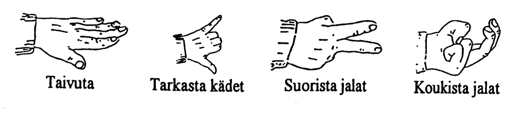
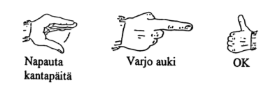

layout: true
name: title
class: middle, center

---

layout: true
name: title2
class: middle, left

---

layout: true
name: default
background-image: url(./jatkokoulutusteoria/bground1.png)
background-position: top left
background-size: no-repeat
background-size: contain

---
template: title

#TEORIA - JATKOKOULUTUSLUOKKAA VARTEN

---
template: default
class: split-70

.column[
# **Siirtyminen jatkokoulutusluokkaan**

-   t18 - FS-hyppääminen

-   t19 - Freehyppääminen

-   t20 - Kuvunkäsittely oppilaana

-   t21 - Omiin varusteisiin siirtyminen

-   t9, 10.3, 10.6, 11 - 13 - Kertaus \[DIAT KESKEN\]

-   Vaaratilanteet ja VV-toimenpiteet (kertaus) \[DIAT KESKEN\]
]

.column[

]

---
template: title2

#t18 FS-hyppääminen. (Formation skydive, flätsi, RW / relative works…)

---
template: default

# **Koulutusohjelma**

- Koulutusohjelman mukaan oppilaan tulee hypätä vähintään **5 ryhmähyppyä**.

- Ohjelma tarjoaa yhdeksän erilaista hyppyohjelmaa/suunnitelmaa.

- **Tavoite** on oppia saapumaan muodostelmaan ja ottamaan ote:

  -   tavoite 1 pysymään samalla tasolla

  -   tavoite 2 oppia liikkumaan eteen ja taakse, ylös ja alas

  -   tavoite 3 ottamaan ote

  -   tavoite 4 oppia tekemään käännöksiä 90-360 -astetta.

---

# **Turvallisuus**

-   Turvallisuusasiat korostuvat, koska mukana on useita hyppääjiä
    lähellä toisiaan.

-   Uloshyppy on aina suunniteltava ja harjoiteltava lentokoneella
    tai uloshyppysimulaattorilla.

-   Hypyn kulku on harjoiteltava laudoilla ja pystyssä (kuivat).

--

-   **Jos uloshyppy epäonnistuu, on kaikkien tiedettävä mitä
    silloin tehdään. Tästä pitää sopia etukäteen.**

--

-   .red.bold[Vapaapudotuksessa on vaarana, että joudutaan toisen hyppääjän ala-
    tai yläpuolelle. -&gt; Ilma ei kanna ja hyppääjä putoaa
    toisen päälle.]

---

# II Turvallisuus

-   Hypyn purkaminen oikeassa korkeudessa on **oppilaan tehtävä.**

-   Hyvä pureva ja suunnassa pysyvä liuku korostuu.

-   On aina oltava varautunut väistämään heti avauksen jälkeen (viedään
    kädet takimmaisille kantohihnoille heti varjon avautumisen jälkeen).

-   Suunniteltu ja ennakoitava varjolla lentely antaa muille
    mahdollisuuden ennakoida.

---

# **Käsimerkit**

Kouluttaja voi antaa NOVA-tasoilta tuttuja käsimerkkejä:
.center[]
.center[]

---

template: title2

#t19 Freehyppääminen

---

#**Koulutusohjelma**

- Tarkoituksena on perehtyä vapaan lentämisen alkeisiin

  -   …antaa joitakin vinkkejä siitä, miten jatkossa kannattaa harjoitella
    perusasennosta poistumista

  -   …ja perusoasentoon palautumiseen.

- Free-asennot ovat selkeästi vaativampia - harjoittelua ei saa ottaa
  liian vakavasti.

- Ensimmäinen kokeiltava asento on sitfly - istuva lentoasento. Muista kaikilla
  sittishypyillä **recovery position!**

---

#**Turvallisuus**

-   **Tarkkaillaan korkeutta**, sillä monissa freeasennoissa
    putoamisvauhti on erittäin kova.

-   Lopetetaan 1800m ja keskitytään avaukseen -&gt; 1400.

-   Työskennellään aina poikittain lennettyyn hyppylinjaan nähden, sillä
    monet freeasennot saattavat väärin tehtyinä ajelehtia (liukua).

-   Freehypyillä on ensiarvoisen tärkeää, että **valjaat ovat sopivat**.

-   Varmistetaan, etteivät **vaatteet pääse** kahvojen ja pampuloiden
    **päälle**.

-   **Apuvarjo oltava tiukasti taskussaan!**

---
template: title2

#**t20 Kuvunkäsittely oppilaana**

---

#**Tavoitteet**

-   Kehittää korkeuden ja etäisyyden arviointikykyä.

-   Oppilas osaisi laskeutua turvallisesti lähelle
    suunniteltua pistettä.

-   Oppilas osaa välttää ruuhkaa finaalissa eli **osaa tarkkailla**
    ilmatilaa ja alkaa **suunnitella** omaa paikkaansa
    laskeutumisjärjestyksessä

-   Oppilas alkaa määritellä itsenäisesti uloshyppypaikkaa, sektoria,
    josta laskeutumisalueelle pääsee sekä alustavasti ohjauskuviot ja
    finaalin aloituspisteen.

-   Oppilas alkaa huomioida vapaapudotuksessa mahdollisen korkeamman
    avauksen tarpeen.

---

#**Turvallisuus**

- Ääriolosuhteita ja asioita, joita **tulisi välttää**, ovat

  -   kova tuuli, erityisesti puuskainen ja **turbulenttinen** keli

  -   toisen **jättövirtauksessa** lentäminen

  -   pienet laskeutumisalueet

  -   **väsyneenä** hyppääminen

  -   turhien **riskien** ottaminen.

- Porrastetaan liikenne mahdollisimman ylhäällä, ei vasta laskeutumiskuviossa.

- **Päätetään tarvittaessa ajoissa varalaskupaikka ja laskusuunta. (600m)**

---

#**Lentäminen**

- Katse 90% ympärille (lentosuunta, sivut, alas, ylös ja taakse) ja 10%
maahan

  - annetaan muillekin lentotilaa

  - ei mennä lähelle, jos ei ole etukäteen sovittu

  - huomioidaan väistämisvelvollisuus

    -   varavarjot, hitaammat kuvut, alemmat ja oikealta tulevat.

- Ohjaillaan rauhallisesti ja keliä tunnustellen.

- Tarkkaillan korkeutta ja korkeuden menetystä liikkeiden aikana.

---
template: title2

# **t21 - Omiin varusteisiin siirtyminen**

---

#**Oppilaskaluston ero kelpparikalustoon**

-   Pienempiä, suurempi siipikuorma, suurempi nopeus alas- ja eteenpäin,
    kasvanut vajaatoimintaherkkyys, suurempi sakkausnopeus, vaativat
    suurempaa tarkkuutta ja reaktionopeutta.

-   Vajoaa käännöksessä enemmän.

-   Lisävarusteet (tukahdutettava slider ja tukahtuva apuvarjo) vaativat
    huolellisuutta pakkaamisessa ja lentämisessä.

-   Pelkkä **siipikuorma ei kerro kaikkea**: pienempi kupu, lyhyemmät
    punokset -&gt; herkempi ohjaus, nopeampi vajoama käännöksessä.

---

#**Pienemmällä kuvulla laskeutumisesta**

- Huomaa suurempi käännösvajoama loppukuvioihin tullessa.

- Loppuveto oltava kaksivaiheinen

  -   ensimmäinen veto saa varjon fleeraamaan -&gt; hyppääjä siirtyy kuvun
      etulaitaan -&gt; kupu alkaa lentää vaakatasossa

  -   toinen veto on rauhallisempi, sen tarkoitus on hidastaa vauhti
      lopullista laskua varten.

---

#**Huomioitavia asioita**

- Hyppääjän on osattava valita varjonsa ominaisuudet omien **kykyjensä**,
  harrastamansa **lajin, hyppymäärän ja** hyppy-**ympäristönsä** mukaan.

- Jatkokoulutuksessa oppilaiden käyttöön SIL:n luettelon mukaan
  (koulutuspäällikön/apulaiskoulutuspäällikön suostumuksella) muitakin kuin
  Navigator.

- SIL rajaa:

  -   alkeis- ja peruskoulutusvaihe &lt; **1,1 lbs/ft2**

  -   jatkokoulutusvaihe sekä A- ja B-lisenssit &lt; **1,34 lbs/ft2** (KTK
      suosittelee silti &lt; 1,1).

---

#**Omien kamojen osto**

- Kysele kerholla kokeneemmilta; **älä osta yksin**.

- Varjokalusto koostuu useasta osasta

  -   valjaat + varavarjo, pääkupu, AAD (Cypres, Vigil), punokset…
      kaikilla on oma huoltoväli ja käyttöikä.

- Kysy kalustoa koekäyttöön, usein mahdollista.

- Tarkistuta kamat kokeneella hyppääjällä (VV-pakkaajat, hyppymestarit…).

- Selvitä kamojen historia

  -   hyppymäärät eri kokonaisuuden osilla, edelliset omistajat, keikat…

---

## **Muut varusteet**

- Kova kypärä: integraali (umpi/visiiri) tai avokypärä

- käsikorkeusmittari;

  - analoginen näyttö selkein lukea, saatavilla myös hypyt tallentava
    yhdistelmämittari

  - digitaalisella numeronäytöllä varustettu on tarkka varjon varassa
    lentämistä varten.

- äänikorkeusmittari eli piippa

- suitti.

---

#**Kuvun pienentämisestä jatkossa...**

- Osattava ainakin seuraavat asiat

  -   korkeutta menettämätön 90-asteen käännös @15m

  -   käännös fleerin aikana vähintään 45-astetta

  -   sivutuulilaskut ja laskeutumiset tyyneen

  -   laskeutuminen toistuvasti 10m rinkiin

  -   etummaisilla vauhditettu laskeutuminen ja käännös
      finaaliin etummaisilla

  -   laskeutuminen ylä- ja alamäkeen

  -   laskeutuminen takaviilekkeillä.

- **HUOM! Tämä on edistynyttä kuvunkäsittelyä -&gt; vain kouluttajan
  neuvomana opettelu, myös kelpparina!**

---
template: title2

# **t9 - Kertaus**

---

.column[# **Uloshyppytyylit**

-   Asettuminen ovelle (mihin jalat, missä kädet).

-   Yhtäaikainen (merkki).

-   Tunkeutuminen suhteelliseen ilmavirtaan.

-   Hyvä taivutus.

-   Raajojen asento!

-   Symmetria.]

.column[

]

---

